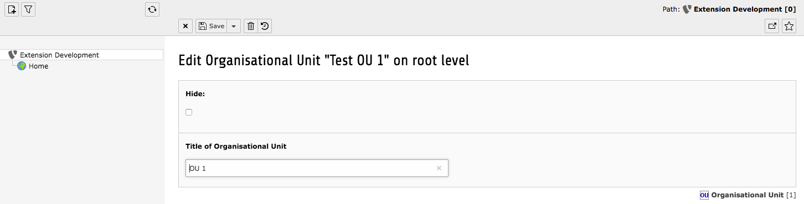
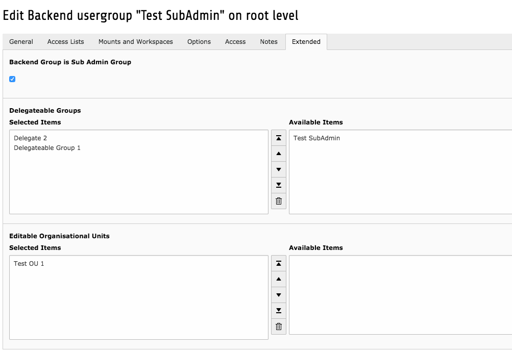
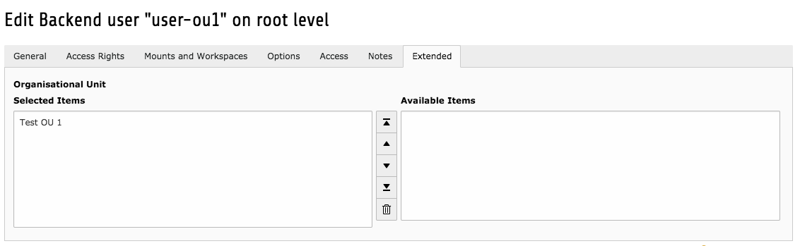
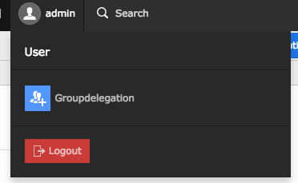
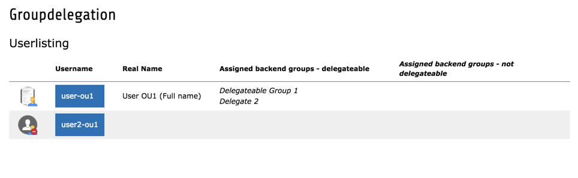
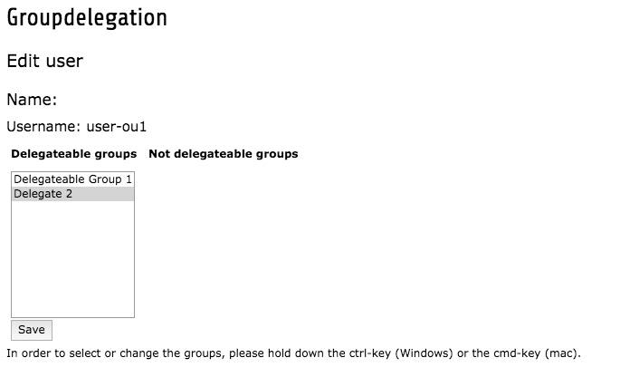

# Groupdelegation

Allows certain backend users to delegate group permissions to other backend users — without requiring a TYPO3 admin account.

- [Installation](#installation)
- [Extension Configuration](#extension-configuration)
- [Site Configuration](#site-configuration)
- [Using Groupdelegation as Sub Admin](#using-groupdelegation-as-sub-admin)
- [How to Contribute](#how-to-contribute)
- [Links](#links)

---

## Introduction

The extension allows certain BE users to delegate BE groups to other BE users without having a TYPO3 admin account. Using organisation units (OUs), you can restrict sub-admins to only manage users within their own OU — e.g. a sub-admin for "marketing" can only delegate groups to marketing users.

Originally developed by Sebastian Müller for Technische Universität München (concept by Bernhard Maier). Currently maintained by [Elementare Teilchen](https://github.com/ElementareTeilchen/groupdelegation).

---

## Installation

```bash
composer require elementareteilchen/groupdelegation
```

---

## Extension Configuration

Go to **Admin Tools > Settings > Extension Configuration > groupdelegation**.

**ignoreOrganisationUnit** (default: enabled)

| Setting | Behaviour |
|---|---|
| Enabled (default) | Sub-admins can manage *every* non-admin BE user |
| Disabled | Sub-admins can only manage BE users in their assigned OUs |

Changing this setting later requires reassigning users and groups.

> **Important:** Be careful with group organisation. A user belonging to both marketing and HR groups (managed by different sub-admins) could inadvertently receive access to both areas if mount points are not configured carefully.

---

## Site Configuration

### 1. Create Organisational Units (OU)

Skip this step if **ignoreOrganisationUnit** is enabled.

OUs are stored at the root level (PID 0). To create one in TYPO3 v14:

1. Open **Content > Records**
2. Click the root entry (TYPO3 logo) at the top of the page tree
3. Create a new **Organisation Unit** record — only a title is required



### 2. Create Sub-Admin Groups

Open a BE user group and go to the **Extended** tab. Enable **"Backend Group is Sub Admin Group"**.

Once enabled, three additional fields appear:

| Field | Description |
|---|---|
| **SubAdmin can activate backend user** | Allows the sub-admin to enable/disable accounts and set start/stop times |
| **Delegatable Groups** | The groups this sub-admin can assign to users in their OU |
| **Editable Organisational Units** | The OUs this sub-admin is responsible for |



The group also needs module access to **User tools** and **User tools > Groupdelegation**.

### 3. Assign Sub-Admin Group to a BE User

Assign the sub-admin group to a BE user just like any other group.

### 4. Assign BE Users to an OU

Open the BE user record, go to the **Extended** tab and assign one or more OUs. Only users assigned to an OU can be managed by sub-admins.



> **Tip:** Use consistent naming conventions for backend groups. A good concept: [typo3worx.eu](https://typo3worx.eu/2017/02/typo3-backend-user-management/)

---

## Using Groupdelegation as Sub Admin

Sub-admins see an additional **Groupdelegation** icon next to their user settings.



Clicking it shows a list of manageable users with their current group assignments.



Click a user to edit their groups. At the top you can disable the account or set start/stop times. Below, check or uncheck delegatable groups and click **Save!**



---

## How to Contribute

- Open a ticket in the [bug tracker](https://github.com/ElementareTeilchen/groupdelegation/issues) before submitting a patch
- Follow [PSR-2](http://www.php-fig.org/psr/psr-2/) coding guidelines
- One logical change per commit, referencing the ticket: `Resolves #9`
- Commit message format: [TYPO3 convention](https://wiki.typo3.org/CommitMessage_Format_(Git))

---

## Links

| | |
|---|---|
| **TER** | https://extensions.typo3.org/extension/groupdelegation/ |
| **Bug Tracker** | https://github.com/ElementareTeilchen/groupdelegation/issues |
| **Git Repository** | https://github.com/ElementareTeilchen/groupdelegation |
